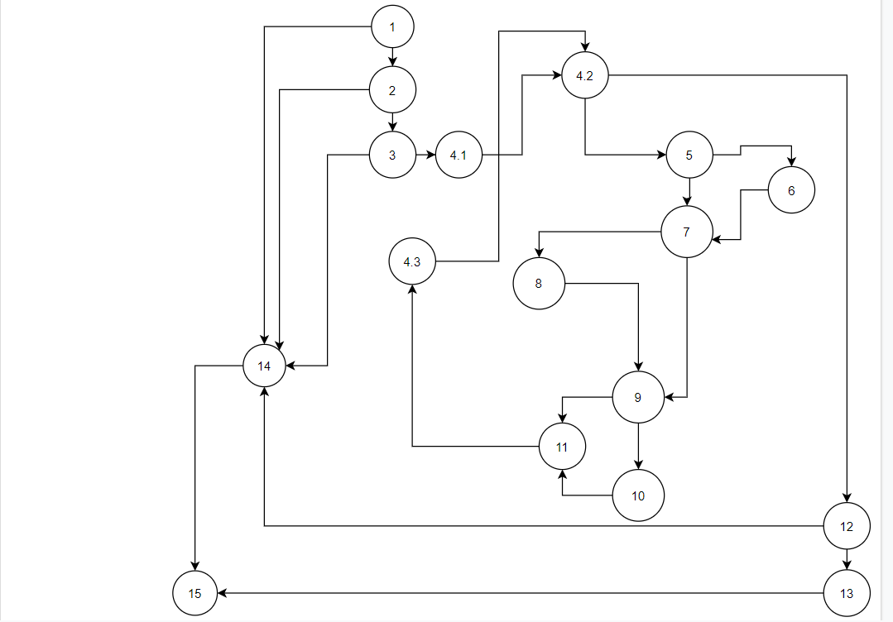

# Втора лабораториска вежба по Софтверско инженерство

## Марио Младеновиќ 172076

### Група на код: 4

Ја добив групата на код 4

###  Control Flow Graph
Фотографија од control flow graph-ot 
 

### Цикломатска комплексност

Комплексноста изнесува 6, тоа е добиено со помош на формулата: E - N + 2 * P каде што E е бројот на линии, а N е бројот на јазли, бројот P е бројот на јазли кои што претставуваат излез од програмата. Во оваа функција броевите изнесуваат:

E = 25
N = 10
P = 2

### Тест случаи според критериумот Every path

1.Slucaj koga user null       
2.Slucaj koga user ne e null ama password i username se null      
3.Slucaj koga user ne e null, username i password ne se null ama password e < 8        
4.Slucaj koga password e bez digit bez upper bez special       
5.Slucaj koga password e so digit bez upper bez special       
6.Slucaj koga passowrd e bez digit so upper bez sepcial       
7.Slucaj koga password e bez digit bez upper so special        
8.Slucaj koga password e so digit so upper bez special       
9.Slucaj koga password e so digit bez upper so special        
10.Slucaj koga password e bez digit so upper so special        
11.Slucaj koga imame dobar password

### Тест случаи според критериумот  MultipleConditions
1.Slucaj koga username != null no pw == null
2.Slucaj koga username = null no pw != null
3.Slucaj koga username == null i pw == null
4.Slucaj koga imame username no password.length < 8
5.Slucaj koga nemam username a password.length >=8
6.Slucaj koga nemam username i password < 8
7.Slucaj koga password e bez digit bez upper bez special
8.Slucaj koga password e so digit bez upper bez special.
9.Slucaj koga e passowrd bez digit so upper bez sepcial
10.Slucaj koga password bez digit bez upper so special
11.Slucaj koga password so digit so upper bez special
12.Slucaj koga password so digit bez upper so special
13.Slucaj koga password bez digit so upper so special
14.Slucaj koga koga imame dobar password

...
### Објаснување на напишаните unit tests

...За EveryPath тестовите опфатени се сите случаи со кои ќе се се измине секој можен пат во програмата. Додека кај MultipleConditions тестовите се опфатени сите If случаи со повеќе услови посебно.
...

